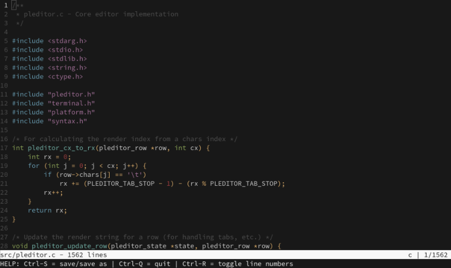

# pleditor

pleditor is a simple text editor that works with terminal devices supporting VT100 escape sequences. The core editor functionality is platform-independent, while platform-specific functionality is abstracted through a clean interface.

## Screenshot



## Features

- Platform independent core
- VT100 terminal interface with status bar
- Colorful syntax highlighting
- Various operations (insert, delete, undo, redo, search, etc.)
- Reference Linux implementation included

## Usage

```bash
# Run without a file (creates new file)
zig build run

# Open an existing file
zig build run -- filename.txt
```

## Keyboard Shortcuts

| Shortcut | Action |
|----------|--------|
| `Ctrl-S` | Save file / Save as |
| `Ctrl-Q` | Quit (with confirmation if unsaved changes) |
| `Ctrl-Z` | Undo |
| `Ctrl-Y` | Redo |
| `Ctrl-F` | Search |
| `Ctrl-N` | Next search result (when searching) |
| `Ctrl-P` | Previous search result (when searching) |
| `Ctrl-R` | Toggle line numbers |
| `Arrow Keys` | Move cursor |
| `Page Up/Down` | Scroll by page |
| `Home/End` | Move to start/end of line |

## License

See LICENSE file for details.
